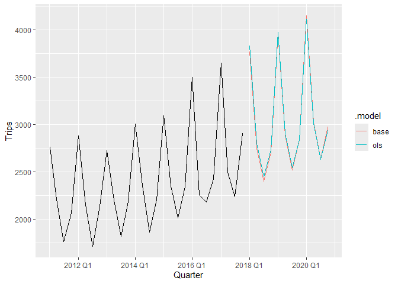
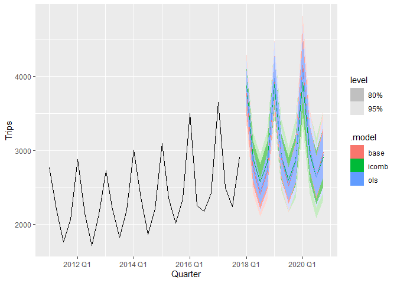

<!-- README.md is generated from README.Rmd. Please edit that file -->

# icomb <a href='https://shanikalw.github.io/icomb/'></a>

<!-- badges: start -->

[](https://www.gnu.org/licenses/gpl-3.0.en.html)
[](https://lifecycle.r-lib.org/articles/stages.html)
[](https://github.com/ShanikaLW/icomb/actions/workflows/R-CMD-check.yaml)
[](https://CRAN.R-project.org/package=icomb)
<!-- badges: end -->

The R package *icomb* provides tools for implementing the information
combination approach to forecasting hierarchical time series proposed by
Nguyen, Vahid and Wickramasuriya (2025).

It offers tools to construct and combine forecasts based on different
information sets, enabling improved forecast accuracy within
hierarchical and grouped time series structures.

## Installation

You can install the **stable** version on CRAN:

``` r
install.packages("icomb")
```

You can install the **development** version from
[GitHub](https://github.com/ShanikaLW/icomb)

``` r
# install.packages("pak")
pak::pak("ShanikaLW/icomb")
```

## Example

``` r
library(fable)
library(fabletools)
library(tsibble)
library(dplyr)
library(lubridate)
library(icomb)
library(ggtime)

tourism_hts <- tourism |>  
  aggregate_key(State * Purpose,
                Trips = sum(Trips)) 

fit <- tourism_hts |>  
  model(base = ETS(Trips)) |>  
  reconcile(ols = min_trace(base, method = "ols"),
            icomb = icomb(base, train_size = 75))
fit
#> # A mable: 45 x 5
#> # Key:     State, Purpose [45]
#>    State           Purpose              base ols          icomb       
#>    <chr*>          <chr*>            <model> <model>      <model>     
#>  1 ACT             Business     <ETS(M,N,M)> <ETS(M,N,M)> <ETS(M,N,M)>
#>  2 ACT             Holiday      <ETS(M,N,A)> <ETS(M,N,A)> <ETS(M,N,A)>
#>  3 ACT             Other        <ETS(M,N,N)> <ETS(M,N,N)> <ETS(M,N,N)>
#>  4 ACT             Visiting     <ETS(M,N,N)> <ETS(M,N,N)> <ETS(M,N,N)>
#>  5 ACT             <aggregated> <ETS(M,A,N)> <ETS(M,A,N)> <ETS(M,A,N)>
#>  6 New South Wales Business     <ETS(M,N,A)> <ETS(M,N,A)> <ETS(M,N,A)>
#>  7 New South Wales Holiday      <ETS(M,N,A)> <ETS(M,N,A)> <ETS(M,N,A)>
#>  8 New South Wales Other        <ETS(A,N,N)> <ETS(A,N,N)> <ETS(A,N,N)>
#>  9 New South Wales Visiting     <ETS(A,N,A)> <ETS(A,N,A)> <ETS(A,N,A)>
#> 10 New South Wales <aggregated> <ETS(A,N,A)> <ETS(A,N,A)> <ETS(A,N,A)>
#> # ℹ 35 more rows

fit |> 
  forecast(h = "3 years") |>  
  filter(Purpose == "Holiday", State == "Victoria") |>  
  autoplot(filter(tourism_hts, Purpose == "Holiday", 
                  State == "Victoria", year(Quarter) > 2010), level = NULL)
```

 We
can compute probabilistic forecasts

``` r
fit |> 
  forecast(h = "3 years", bootstrap = TRUE, times = 1000) |> 
  filter(Purpose == "Holiday", State == "Victoria") |>
  autoplot(filter(tourism_hts, Purpose == "Holiday",
                  State == "Victoria", year(Quarter) > 2010))
```



This workflow can be parallelized to improve performance using the
`future` package. By specifying a parallelization plan via
`future::plan()` (e.g., `multisession` or `multicore`), users can
control how computations are distributed across available workers. This
allows the cross-validation procedure in the information combination
approach to run in parallel without modifying the core code, while
remaining flexible to different computing environments. If no plan is
set, the default sequential strategy is used, meaning computations are
performed one after another with no parallelization.

``` r
library(future)
plan(multisession, workers = 2)

tourism_hts |>  
  model(base = ETS(Trips)) |>  
  reconcile(ols = min_trace(base, method = "ols"),
            icomb = icomb(base, train_size = 75))  |>  
  forecast(h = "3 years") 
#> # A fable: 1,620 x 6 [1Q]
#> # Key:     State, Purpose, .model [135]
#>    State  Purpose  .model Quarter
#>    <chr*> <chr*>   <chr>    <qtr>
#>  1 ACT    Business base   2018 Q1
#>  2 ACT    Business base   2018 Q2
#>  3 ACT    Business base   2018 Q3
#>  4 ACT    Business base   2018 Q4
#>  5 ACT    Business base   2019 Q1
#>  6 ACT    Business base   2019 Q2
#>  7 ACT    Business base   2019 Q3
#>  8 ACT    Business base   2019 Q4
#>  9 ACT    Business base   2020 Q1
#> 10 ACT    Business base   2020 Q2
#> # ℹ 1,610 more rows
#> # ℹ 2 more variables: Trips <dist>, .mean <dbl>
plan(sequential)
```

## References

- Nguyen, M., Vahid, F., & Wickramasuriya, S. L. (2025). Hierarchical
  Forecasting: The Role of Information Combination (Working Paper
  No. 11/25). Department of Econometrics and Business Statistics, Monash
  University.
