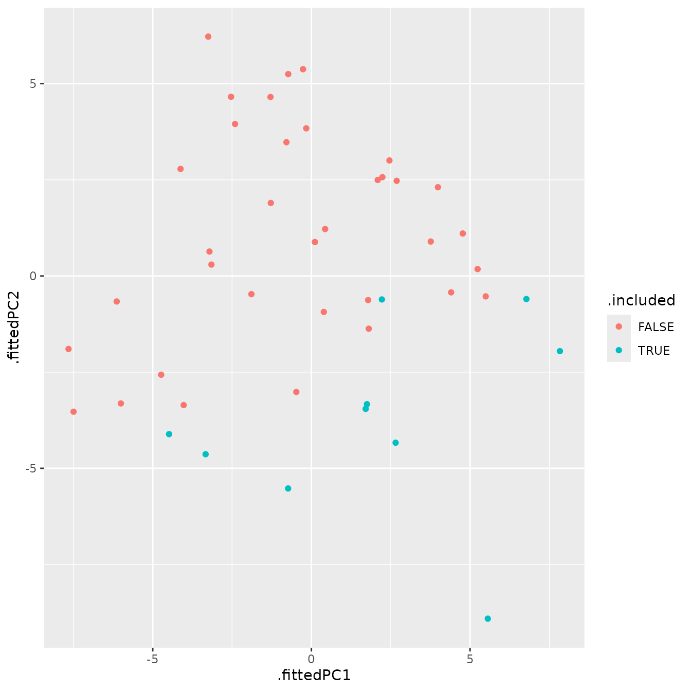
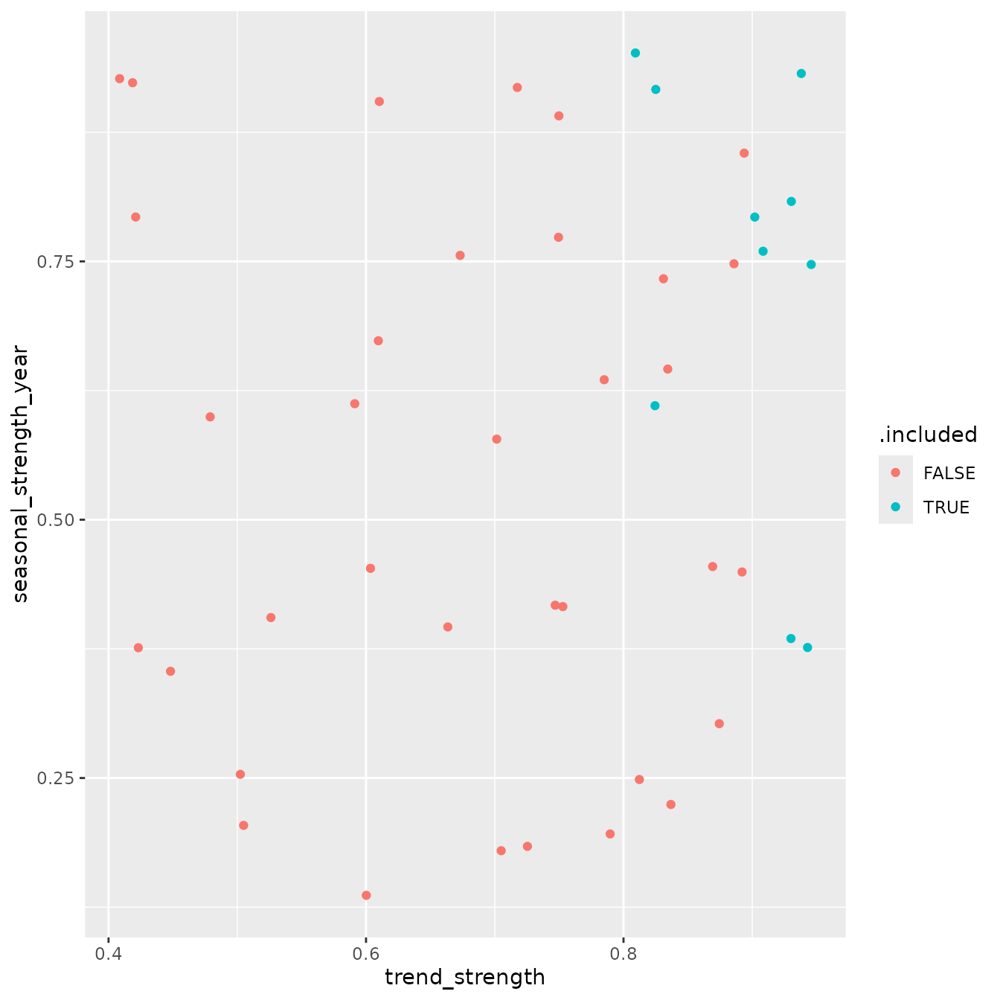
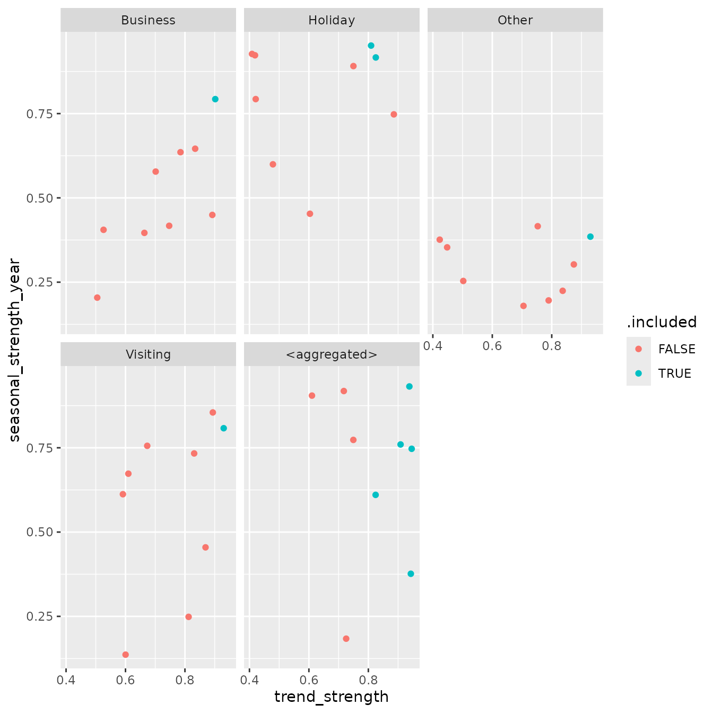

# icomb

## Introduction

Forecast reconciliation is used to make forecasts coherent across a
hierarchy or grouped structure. In the Australian tourism data, trips
can be aggregated by `State`, by `Purpose`, and by their combinations.
If forecasts are produced independently for each series, the results
will generally not add up correctly across the structure.

This vignette demonstrates a workflow that goes a step further than
reconciliation alone. Alongside coherent forecasts, we also examine
which series are selected by `icomb`, and whether those series exhibit
distinctive time series characteristics.

The analysis proceeds in four stages:

1.  construct a grouped tourism structure

2.  fit base forecast models and reconcile the forecasts

3.  extract series inclusion information from `icomb`

4.  relate inclusion of series to feature-based summaries or accuracy of
    the series.

## Packages

``` r
library(dplyr)
library(tsibble)
library(fable)
library(icomb)
library(feasts)
library(ggplot2)
library(plotly)
```

## Workflow

### Building a grouped tourism structure

We begin with the `tourism` dataset available in the `tsibble` package
and aggregate trips across the `State` and `Purpose` dimensions to
create a simple grouped structure.

``` r
tourism_gts <- tourism |> 
  aggregate_key(State * Purpose,
                Trips = sum(Trips))
tourism_gts
#> # A tsibble: 3,600 x 4 [1Q]
#> # Key:       State, Purpose [45]
#> Loading required namespace: crayon
#>    Quarter State        Purpose       Trips
#>      <qtr> <chr*>       <chr*>        <dbl>
#>  1 1998 Q1 <aggregated> <aggregated> 23182.
#>  2 1998 Q2 <aggregated> <aggregated> 20323.
#>  3 1998 Q3 <aggregated> <aggregated> 19827.
#>  4 1998 Q4 <aggregated> <aggregated> 20830.
#>  5 1999 Q1 <aggregated> <aggregated> 22087.
#>  6 1999 Q2 <aggregated> <aggregated> 21458.
#>  7 1999 Q3 <aggregated> <aggregated> 19914.
#>  8 1999 Q4 <aggregated> <aggregated> 20028.
#>  9 2000 Q1 <aggregated> <aggregated> 22339.
#> 10 2000 Q2 <aggregated> <aggregated> 19941.
#> # ℹ 3,590 more rows
```

This grouped structure contains the total, the marginal aggregates
(i.e., state level aggregates and purpose level aggregates), and the
bottom-level series defined by each `State` and `Purpose` combination.
These connected series form a natural setting for forecast
reconciliation.

### Fitting base forecasts

We next fit an ETS model to every series in the grouped structure. You
can fit any other univariate models or multivariate model(s).

``` r
fit <- tourism_gts |> 
  model(base = ETS(Trips))
fit
#> # A mable: 45 x 3
#> # Key:     State, Purpose [45]
#>    State           Purpose              base
#>    <chr*>          <chr*>            <model>
#>  1 ACT             Business     <ETS(M,N,M)>
#>  2 ACT             Holiday      <ETS(M,N,A)>
#>  3 ACT             Other        <ETS(M,N,N)>
#>  4 ACT             Visiting     <ETS(M,N,N)>
#>  5 ACT             <aggregated> <ETS(M,A,N)>
#>  6 New South Wales Business     <ETS(M,N,A)>
#>  7 New South Wales Holiday      <ETS(M,N,A)>
#>  8 New South Wales Other        <ETS(A,N,N)>
#>  9 New South Wales Visiting     <ETS(A,N,A)>
#> 10 New South Wales <aggregated> <ETS(A,N,A)>
#> # ℹ 35 more rows
```

These are the base forecasts. Since each series is modelled
independently, the forecasts are not guaranteed to be coherent with the
aggregation constraints.

### Reconciling base forecasts

We reconcile the base forecasts using two methods.

- `ols`: MinT reconciliation with \mathbf{W}\_h \propto \mathbf{I}

- `icomb`: the `icomb` reconciliation method with group lasso penalty
  (default option)

``` r
fit_recon <- fit |> 
  reconcile(
    ols = min_trace(base, method = "ols"),
    icomb = icomb(base, train_size = 55)
  )
fit_recon
#> # A mable: 45 x 5
#> # Key:     State, Purpose [45]
#>    State           Purpose              base ols          icomb       
#>    <chr*>          <chr*>            <model> <model>      <model>     
#>  1 ACT             Business     <ETS(M,N,M)> <ETS(M,N,M)> <ETS(M,N,M)>
#>  2 ACT             Holiday      <ETS(M,N,A)> <ETS(M,N,A)> <ETS(M,N,A)>
#>  3 ACT             Other        <ETS(M,N,N)> <ETS(M,N,N)> <ETS(M,N,N)>
#>  4 ACT             Visiting     <ETS(M,N,N)> <ETS(M,N,N)> <ETS(M,N,N)>
#>  5 ACT             <aggregated> <ETS(M,A,N)> <ETS(M,A,N)> <ETS(M,A,N)>
#>  6 New South Wales Business     <ETS(M,N,A)> <ETS(M,N,A)> <ETS(M,N,A)>
#>  7 New South Wales Holiday      <ETS(M,N,A)> <ETS(M,N,A)> <ETS(M,N,A)>
#>  8 New South Wales Other        <ETS(A,N,N)> <ETS(A,N,N)> <ETS(A,N,N)>
#>  9 New South Wales Visiting     <ETS(A,N,A)> <ETS(A,N,A)> <ETS(A,N,A)>
#> 10 New South Wales <aggregated> <ETS(A,N,A)> <ETS(A,N,A)> <ETS(A,N,A)>
#> # ℹ 35 more rows
```

The `icomb` method with group lasso penalty is especially useful for
exploratory analysis because it allows us to study which series are
included in the information combination process.

### Inspecting reconciliation output

To investigate the behaviour of `icomb`, we glance the reconciliation
results which provides `.included` variable indicating which series are
selected by `icomb` for reconciliation.

``` r
glance_output <- fit_recon |> 
  glance()
glance_output
#> # A tibble: 135 × 12
#>    State  Purpose  .model sigma2 log_lik   AIC  AICc   BIC   MSE  AMSE
#>    <chr*> <chr*>   <chr>   <dbl>   <dbl> <dbl> <dbl> <dbl> <dbl> <dbl>
#>  1 ACT    Business base   0.0540   -453.  919.  921.  936. 1069. 1071.
#>  2 ACT    Business ols    0.0540   -453.  919.  921.  936. 1069. 1071.
#>  3 ACT    Business icomb  0.0540   -453.  919.  921.  936. 1069. 1071.
#>  4 ACT    Holiday  base   0.0680   -463.  940.  941.  956. 1509. 1538.
#>  5 ACT    Holiday  ols    0.0680   -463.  940.  941.  956. 1509. 1538.
#>  6 ACT    Holiday  icomb  0.0680   -463.  940.  941.  956. 1509. 1538.
#>  7 ACT    Other    base   0.202    -376.  759.  759.  766.  154.  156.
#>  8 ACT    Other    ols    0.202    -376.  759.  759.  766.  154.  156.
#>  9 ACT    Other    icomb  0.202    -376.  759.  759.  766.  154.  156.
#> 10 ACT    Visiting base   0.0305   -450.  905.  905.  912.  965. 1038.
#> # ℹ 125 more rows
#> # ℹ 2 more variables: MAE <dbl>, .included <lgl>
```

### Computing time series features

To describe the series in the structure statistically, we compute a
broad collection of features using **feasts**.

``` r
tourism_features <- tourism_gts |>
  features(Trips, feature_set(pkgs = "feasts"))
tourism_features
#> # A tibble: 45 × 50
#>    State           Purpose      trend_strength seasonal_strength_year
#>    <chr*>          <chr*>                <dbl>                  <dbl>
#>  1 ACT             Business              0.526                  0.405
#>  2 ACT             Holiday               0.603                  0.453
#>  3 ACT             Other                 0.502                  0.254
#>  4 ACT             Visiting              0.600                  0.136
#>  5 ACT             <aggregated>          0.725                  0.184
#>  6 New South Wales Business              0.785                  0.635
#>  7 New South Wales Holiday               0.750                  0.891
#>  8 New South Wales Other                 0.874                  0.303
#>  9 New South Wales Visiting              0.831                  0.733
#> 10 New South Wales <aggregated>          0.908                  0.760
#> # ℹ 35 more rows
#> # ℹ 46 more variables: seasonal_peak_year <dbl>, seasonal_trough_year <dbl>,
#> #   spikiness <dbl>, linearity <dbl>, curvature <dbl>, stl_e_acf1 <dbl>,
#> #   stl_e_acf10 <dbl>, acf1 <dbl>, acf10 <dbl>, diff1_acf1 <dbl>,
#> #   diff1_acf10 <dbl>, diff2_acf1 <dbl>, diff2_acf10 <dbl>, season_acf1 <dbl>,
#> #   pacf5 <dbl>, diff1_pacf5 <dbl>, diff2_pacf5 <dbl>, season_pacf <dbl>,
#> #   zero_run_mean <dbl>, nonzero_squared_cv <dbl>, zero_start_prop <dbl>, …
```

These features capture properties such as trend strength, seasonal
strength, autocorrelation, linearity, and aspects of forecastability.
See the online [Forecasting: Principles and
Practice](https://otexts.com/fpp3/features.html) textbook for a detailed
description of these features.

Rather than inspecting dozens of features one at a time, it is often
useful to summarise them in a smaller feature space.

### Reducing the feature space with PCA

We use principal component analysis (PCA) to obtain a low-dimensional
representation of the features.

``` r
pcs <- tourism_features |>
  select(-State, -Purpose, -zero_run_mean, -zero_start_prop, -zero_end_prop) |>
  prcomp(scale = TRUE) |>
  broom::augment(tourism_features)
pcs
#> # A tibble: 45 × 96
#>    .rownames State           Purpose      trend_strength seasonal_strength_year
#>    <chr>     <chr*>          <chr*>                <dbl>                  <dbl>
#>  1 1         ACT             Business              0.526                  0.405
#>  2 2         ACT             Holiday               0.603                  0.453
#>  3 3         ACT             Other                 0.502                  0.254
#>  4 4         ACT             Visiting              0.600                  0.136
#>  5 5         ACT             <aggregated>          0.725                  0.184
#>  6 6         New South Wales Business              0.785                  0.635
#>  7 7         New South Wales Holiday               0.750                  0.891
#>  8 8         New South Wales Other                 0.874                  0.303
#>  9 9         New South Wales Visiting              0.831                  0.733
#> 10 10        New South Wales <aggregated>          0.908                  0.760
#> # ℹ 35 more rows
#> # ℹ 91 more variables: seasonal_peak_year <dbl>, seasonal_trough_year <dbl>,
#> #   spikiness <dbl>, linearity <dbl>, curvature <dbl>, stl_e_acf1 <dbl>,
#> #   stl_e_acf10 <dbl>, acf1 <dbl>, acf10 <dbl>, diff1_acf1 <dbl>,
#> #   diff1_acf10 <dbl>, diff2_acf1 <dbl>, diff2_acf10 <dbl>, season_acf1 <dbl>,
#> #   pacf5 <dbl>, diff1_pacf5 <dbl>, diff2_pacf5 <dbl>, season_pacf <dbl>,
#> #   zero_run_mean <dbl>, nonzero_squared_cv <dbl>, zero_start_prop <dbl>, …
```

The coordinates `.fittedPC1` and `.fittedPC2` summarize the dominant
variation across the extracted series features.

### Joining features, node inclusion, and accuracy

To compare statistical features with reconciliation behaviour, we join
together

- the PCA representation
- the node inclusion indicator from `icomb`, and
- base-model accuracy measures

``` r
all_info <- glance_output |>
  filter(.model == "icomb") |>
  select(State, Purpose, .included) |>
  full_join(pcs, by = c("State", "Purpose"))

all_info <- accuracy(fit) |>
  select(-.model, -.type) |>
  full_join(all_info, by = c("State", "Purpose"))
all_info
#> # A tibble: 45 × 105
#>    State        Purpose       ME  RMSE   MAE      MPE  MAPE  MASE RMSSE     ACF1
#>    <chr*>       <chr*>     <dbl> <dbl> <dbl>    <dbl> <dbl> <dbl> <dbl>    <dbl>
#>  1 ACT        … Business    4.90  32.7  26.7  -1.52   18.6  0.703 0.739  0.0312 
#>  2 ACT        … Holiday     3.63  38.9  28.5  -2.00   18.6  0.839 0.842  0.110  
#>  3 ACT        … Other       1.32  12.4  10.2 -16.0    42.6  0.789 0.773  0.0614 
#>  4 ACT        … Visiting    3.28  31.1  23.2  -0.622  12.2  0.684 0.704  0.0737 
#>  5 ACT        … <aggregat…  7.91  60.9  49.0   0.0964  9.75 0.709 0.697  0.0913 
#>  6 New South W… Business    9.69 128.  102.   -0.0675  8.10 0.785 0.789 -0.0967 
#>  7 New South W… Holiday     8.36 168.  136.   -0.0168  4.56 0.805 0.785  0.00534
#>  8 New South W… Other       5.91  41.4  34.9   0.0551 12.1  0.851 0.828 -0.0737 
#>  9 New South W… Visiting   13.9  151.  124.    0.202   5.21 0.696 0.699  0.0391 
#> 10 New South W… <aggregat… 32.6  300.  243.    0.268   3.53 0.731 0.725 -0.0306 
#> # ℹ 35 more rows
#> # ℹ 95 more variables: .included <lgl>, .rownames <chr>, trend_strength <dbl>,
#> #   seasonal_strength_year <dbl>, seasonal_peak_year <dbl>,
#> #   seasonal_trough_year <dbl>, spikiness <dbl>, linearity <dbl>,
#> #   curvature <dbl>, stl_e_acf1 <dbl>, stl_e_acf10 <dbl>, acf1 <dbl>,
#> #   acf10 <dbl>, diff1_acf1 <dbl>, diff1_acf10 <dbl>, diff2_acf1 <dbl>,
#> #   diff2_acf10 <dbl>, season_acf1 <dbl>, pacf5 <dbl>, diff1_pacf5 <dbl>, …
```

This gives a single data frame linking each series to its features,
inclusion status, and forecast accuracy metrics.

### Visualizing series inclusion in feature space

A useful first question is whether included and excluded series occupy
different regions of the feature space.

``` r
tourism_viz <- all_info |>
  ggplot(aes(
    x = .fittedPC1,
    y = .fittedPC2,
    colour = .included,
    text = paste0(
      "PC1: ", round(.fittedPC1, 2), "<br>",
      "PC2: ", round(.fittedPC2, 2), "<br>",
      "State: ", State, "<br>",
      "Purpose: ", Purpose, "<br>",
      "MAPE: ", round(MAPE, 2), "<br>",
      "RMSSE: ", round(RMSSE, 2), "<br>",
      "MASE: ", round(MASE, 2)
    )
  )) +
  geom_point()
tourism_viz
```



This plot provides a compact view of whether series inclusion in `icomb`
is associated with the broad statistical profile of a series.

For interactive exploration in HTML output, the plot can also be
converted with **plotly**.

``` r
tourism_viz |>
  ggplotly(tooltip = "text")
```

### Examining interpretable features directly

While PCA is useful for summarizing many features at once, it is often
easier to interpret individual features directly. Two especially common
summaries are trend strength and annual seasonal strength.

``` r
tourism_feature_plot <- all_info |>
  ggplot(aes(
    x = trend_strength,
    y = seasonal_strength_year,
    colour = .included,
    text = paste0(
      "Trend_strength: ", round(trend_strength, 2), "<br>",
      "Seasonal_strength_year: ", round(seasonal_strength_year, 2), "<br>",
      "State: ", State, "<br>",
      "Purpose: ", Purpose, "<br>"
    )
  )) +
  geom_point()
tourism_feature_plot
```



This plot helps assess whether included series tend to be more strongly
trended, more seasonal, or broadly similar to excluded series.

An interactive version can also be produced

``` r
tourism_feature_plot |>
  ggplotly(tooltip = "text")
```

### Comparing behaviour across travel purpose

The relationship between structure and inclusion of series may differ by
travel purpose. To explore this, we facet the trend-seasonality display
by `Purpose`.

``` r
tourism_purpose_plot <- all_info |>
  ggplot(aes(
    x = trend_strength,
    y = seasonal_strength_year,
    colour = .included,
    text = paste0(
      "State: ", State, "<br>",
      "Purpose: ", Purpose, "<br>")
  )) +
  geom_point() +
  facet_wrap(vars(Purpose))
tourism_purpose_plot
```



An interactive version can also be produced when desired.

``` r
tourism_purpose_plot |>
  ggplotly(text = "text")
```

### Interpreting the results

This workflow makes it possible to ask questions such as:

- Do included series tend to be more regular or more forecastable?

- Are highly seasonal series more likely to be selected by `icomb`?

- Is inclusion associated with stronger or weaker base forecast
  accuracy?

- Do patterns differ systematically across purpose groups?

The answers will depend on the data and the implementation details of
`icomb`, but the framework provides a practical way to connect
reconciliation output with interpretable series characteristics.

## Beyond summing constraints

The reconciliation methods discussed above are not limited to simple
summation constraints. In general, both MinT based approaches and
information combination methods can accommodate any *linear* constraints
across a system of time series.

At present, the
[`min_trace()`](https://fabletools.tidyverts.org/reference/min_trace.html)
implementation in **fabletools** is restricted to summing constraints.
The [`icomb()`](https://shanikalw.github.io/icomb/reference/icomb.md)
approach, however, is more flexible and can be used in settings where
the aggregation structure is defined differently.

### Using averages instead of sums

As an illustration, suppose the structure is defined in terms of
*averages* rather than totals. We can construct such a grouped structure
by aggregating using [`mean()`](https://rdrr.io/r/base/mean.html)
instead of [`sum()`](https://rdrr.io/r/base/sum.html).

``` r
tourism_avg_gts <- tourism_gts |>
  filter(!is_aggregated(State), !is_aggregated(Purpose)) |>
  aggregate_key(State * Purpose,
                Trips = mean(Trips))
```

We then fit and reconcile forecasts in the usual way.

``` r
fc <- tourism_avg_gts |>
  model(base = ETS(Trips)) |>
  reconcile(icomb = icomb(base, train_size = 55)) |>
  forecast()
```

To verify coherence under this alternative structure, we can recompute
the averages from the bottom-level forecasts and compare them with the
reconciled values.

``` r
fc |>
  filter(!is_aggregated(State), !is_aggregated(Purpose), .model == "icomb") |>
  aggregate_key(State * Purpose,
                mean_fc = mean(.mean)) |>
  full_join(fc |> filter(.model == "icomb")) |>
  mutate(diff = mean_fc - .mean) |>
  pull(diff) |>
  range()
#> Joining with `by = join_by(Quarter, State, Purpose)`
#> [1] -4.547474e-13  9.094947e-13
```

The range of differences is close to zero.

### Current limitations and extensions

The current implementation of
[`aggregate_key()`](https://fabletools.tidyverts.org/reference/aggregate_key.html)
in **fabletools** does not yet support arbitrary weights, which limits
direct construction of more general linear constraints. This is expected
to be addressed in future releases.

In the meantime, for fully general linear constraints, a practical
approach is to manually construct a `tsibble` containing all series in
the desired structure and pass it directly to
[`model()`](https://fabletools.tidyverts.org/reference/model.html). This
provides complete flexibility in defining relationships among the
series.
